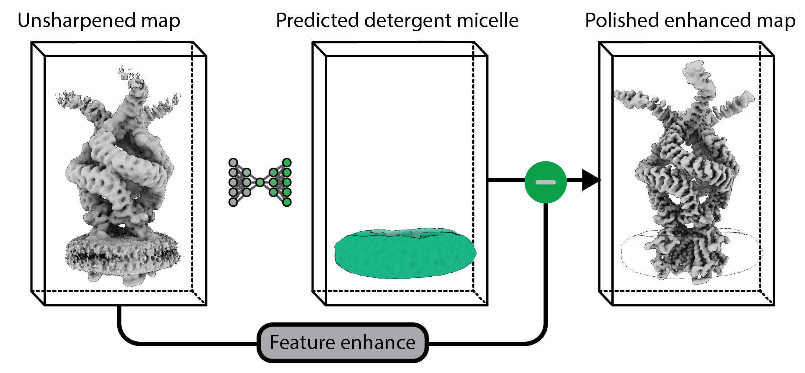
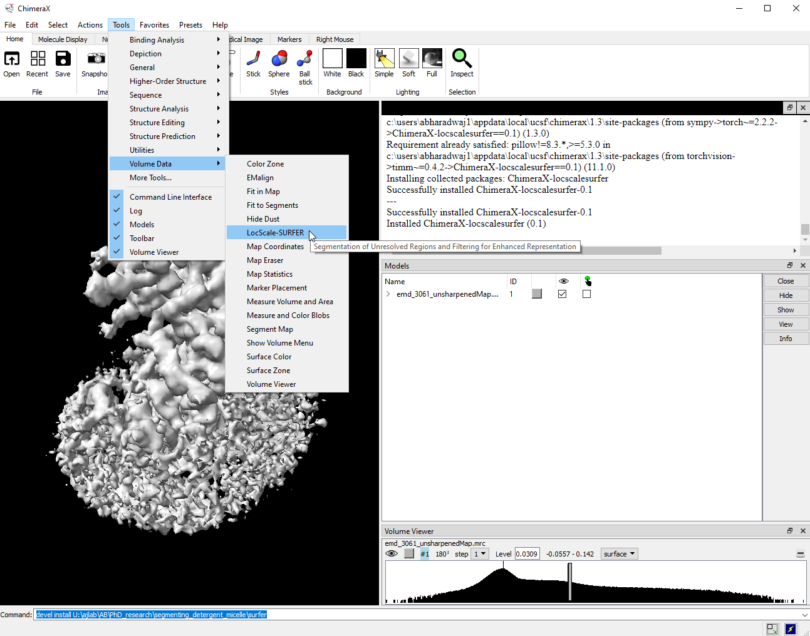
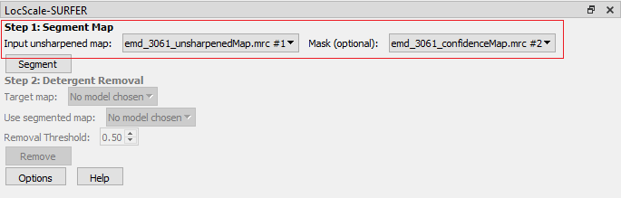
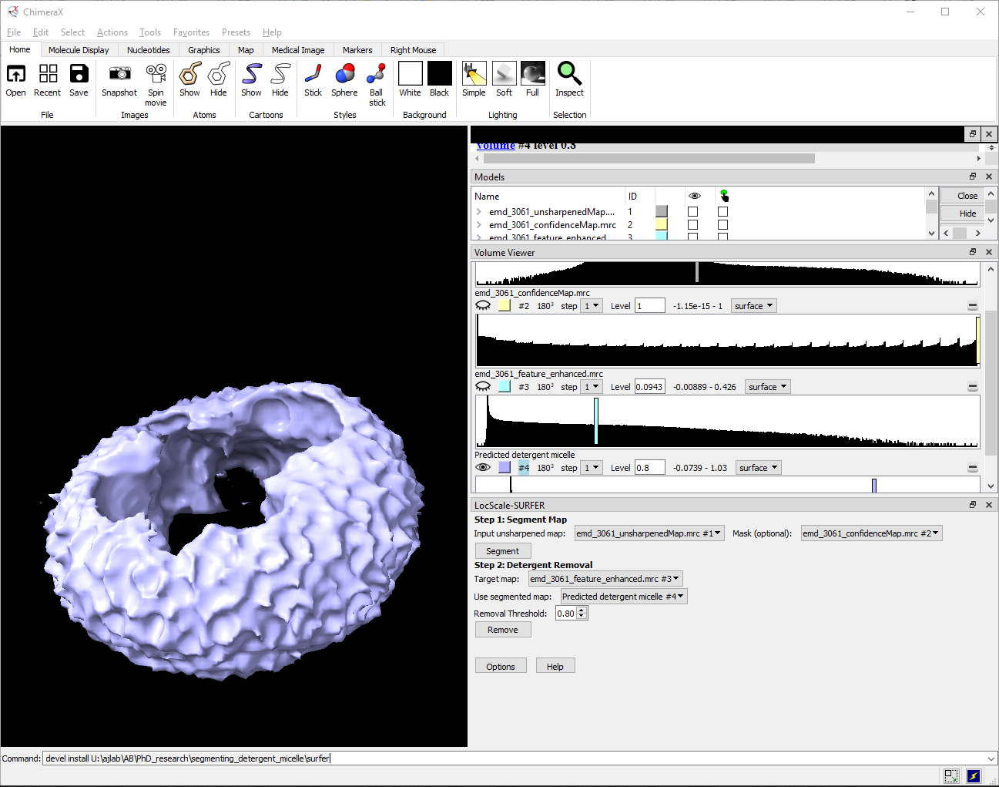
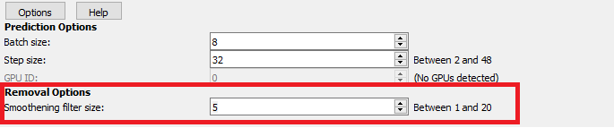
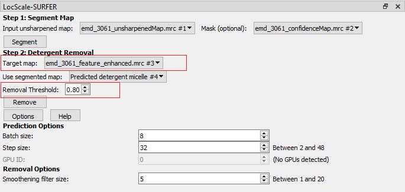
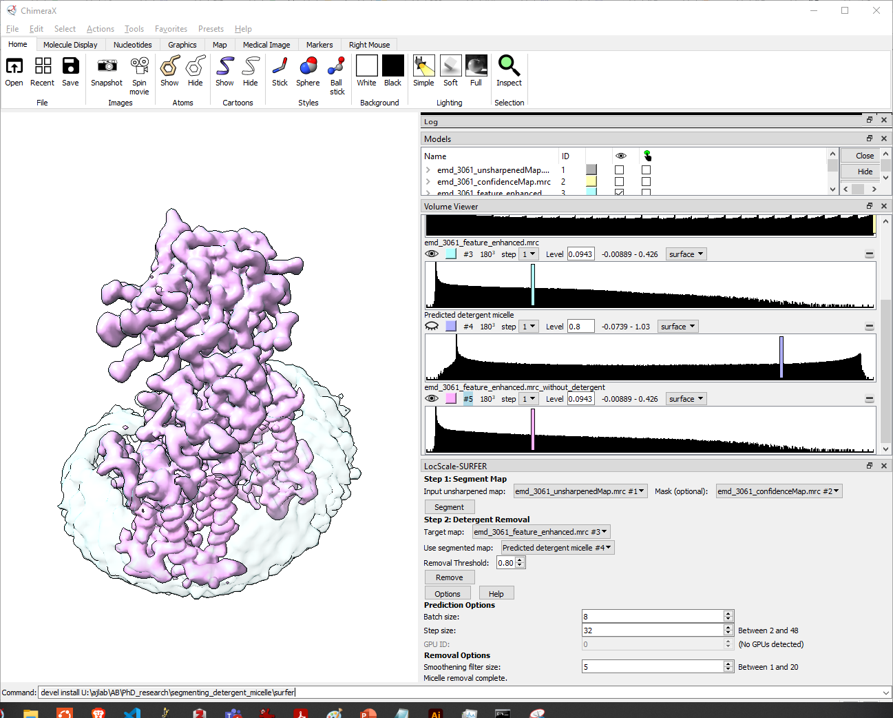

# LocScale-SURFER (**S**egmentation of **U**nresolved **R**egions and **F**iltering for **E**nhanced **R**epresentation)
## ChimeraX Bundle 

LocScale-SURFER is a ChimeraX bundle for enhancing representation of transmembrane regions of membrane proteins. It is trained to segment voxels corresponding to the micelle belt of an unsharpened cryo-EM reconstruction. The segmented map can then be used to remove micelle densities from the target map. 



Note, there are two ways to speed up the computation. One is to provide a mask which restricts the prediction of detergent micelle to the region of interest. The other is to use a GPU for computation. By default, the tool uses a GPU if available. 

## Installation

### From source code: 
1. Clone the repository: 
```bash
git clone https://gitlab.tudelft.nl/aj-lab/surfer.git
```
Note the full path of the cloned repository.
PATH_TO_REPO = path/to/surfer

2. Open ChimeraX and navigate to the command line interface.

3. Install the bundle by running the following command:
```chimerax
devel install PATH_TO_REPO
devel clean PATH_TO_REPO
```
4. Restart ChimeraX.
5. You should now see the LocScale-SURFER tool in: ```Tools > Volume Data > LocScale-SURFER ```



## User Guide

1. Open LocScale-SURFER by navigating to: ```Tools > Volume Data > LocScale-SURFER ``` (as shown in the image above).

2. Select the Input unsharpened map. For best performance, use unsharpened, FSC-filtered map as inputs to the model. 

Note: for faster computation, especially on a CPU, provide a mask to restrict the prediction to the region of interest.



3. Click *Segment* to predict the detergent micelle belt. The segmented map will be displayed in the Volume Viewer as <b> Predicted detergent micelle </b>.



4. Choose an appropriate threshold to binarize the prediction using the "Removal Threshold" option. Once binarized, the segmented map will be smoothened using a uniform filter to remove subtraction artefacts. You can change the filter size under the "Options" button. 



5. Choose the "Target map" from which the detergent micelle belt will be removed.



6. Click *Remove* to subtract the detergent micelle belt from the target map. The resulting map will be displayed in the Volume Viewer with the same name as the target map but with the suffix <b> _without_detergent </b>
 

The final output is shown at the same isosurface threshold as the target map for better comparison. The target map is rendered transparent to show the difference. 


